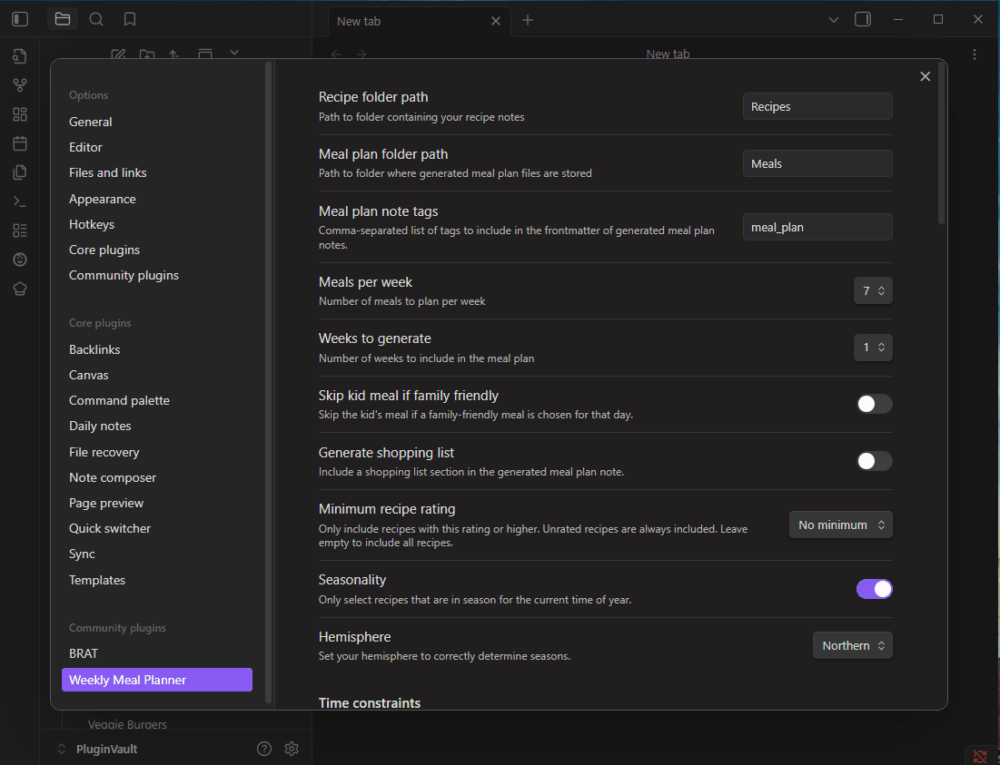

# 🍽️ Weekly Meal Planner (Obsidian Plugin)

Generate weekly meal plans and shopping lists from your recipe notes in Obsidian.

## ✨ Features

- **Weekly Meal Plan Generation**: Automatically create meal plans for one or more weeks, with customizable days, constraints, and folders.
- **Recipe Ratings**: Optionally rate your recipes on a 1-5 star scale. When present, ratings are factored into the meal selection scoring to favor higher-rated recipes.
- **Change/Swap Meals**: Easily change or swap meals for any day using commands.
- **Create Recipe Notes**: Quickly create new recipe notes with a structured template using the "Create new recipe note" command.
- **Kid & Family Friendly Logic**: Supports kid meals, family-friendly recipes, and per-day constraints.
- **Shopping List**: Generates a shopping list organized by week, day, and recipe, with clear ingredient breakdowns.
- **Recipe Variety**: Avoids repeating recipes recently used, using a scoring system that prevents consecutive identical meals.
- **Settings UI**: Configure folders, number of meals/weeks, day constraints, and more from the settings tab.

## 📸 Demo




## 🚀 Usage

1. **Add Recipes**: Place your recipe markdown files in the configured recipe folder, or use the "Create new recipe note" command to quickly create a structured recipe template. Each recipe should have frontmatter for tags, prep/cook time, difficulty, etc.
2. **Rate Your Recipes (Optional)**: Add a `rating: 1-5` field to your recipe frontmatter. When present, these ratings are factored into meal selection to favor higher-rated recipes.
3. **Generate Meal Plan**: Click the chef hat icon or use the command palette to generate a new meal plan.
4. **Change or Swap Meals**: Use the "Change Meal" or "Swap Meals" commands to update your plan with dropdown-driven modals.
5. **View Shopping List**: The generated meal plan note includes a shopping list, organized by week, day, and recipe.

> **💡 Note**: For the shopping list to work properly, each recipe must include an "## Ingredients" section (h2 header) with ingredients listed as bullet points (e.g., `- 500g ground beef`). The plugin automatically extracts these ingredients to generate your shopping list.

> **⭐ Rating Tip**: Recipe ratings are completely optional! If you add them, higher-rated recipes will be favored during selection. You can also set a minimum rating filter to only include recipes above a certain threshold.

## 📝 Example Recipe Format

```markdown
---
tags:
  - dinner
  - italian
meal_type: pasta
prep_time: 10
cook_time: 25
difficulty: easy
family_friendly: true
kid_friendly: true
season: []
rating: 5
---

# 🍝 Spaghetti and Meatballs

## 🛒 Ingredients
- 500g ground beef
- 1 egg
- 1/2 cup breadcrumbs
- 1/4 cup parmesan cheese
- 2 cloves garlic
- 400g spaghetti
- 700g marinara sauce
- salt and pepper
- italian seasoning

## 👩‍🍳 Instructions
1. 🔥 Preheat oven to 400°F
2. 🥣 Mix ground beef, egg, breadcrumbs, parmesan, minced garlic, salt, pepper, and italian seasoning
3. ⚽ Form into 1-inch meatballs and place on baking sheet
4. ⏲️ Bake for 20-25 minutes until cooked through
5. 🍝 Meanwhile, cook spaghetti according to package directions
6. 🍅 Heat marinara sauce in a large pot
7. 🥘 Add cooked meatballs to sauce and simmer for 5 minutes
8. 🍽️ Serve meatballs and sauce over spaghetti
9. 🧀 Top with extra parmesan

_...other note headings and text..._
```

## ⚙️ Settings
- **Recipe folder path**: Where your recipes are stored.
- **Meal plan folder path**: Where generated meal plans are saved.
- **Meal plan note tags**: List of tags to include in the frontmatter of generated meal plan notes.
- **Meals per week**: Number of meals to plan each week.
- **Weeks to generate**: Number of weeks to include in each plan.
- **Skip kid meal if family friendly**: Skip the kid's meal if a meal is family-friendly.
- **Generate shopping list**: Include a shopping list in the generated meal plan note.
- **Minimum recipe rating**: Only include recipes with this rating or higher (1-5 stars). Leave empty to include all recipes regardless of rating.
- **Seasonality**: Only select recipes that are in season for the current time of year.
- **Hemisphere**: Set your hemisphere to correctly determine the season.
- **Time constraints**: Set max time for each meal
- **Difficulty constraints**: Set the max difficulty for each meal
- **Kid meal options**: Toggle for kid's meal each day
- **Customize Icons**: Customize icons for days and difficulty levels.

## 💾 Installation
1. Clone or download this repository.
2. Build the plugin with `npm install && npm run build`.
3. Copy the output files to your Obsidian vault's plugins folder.
4. Enable the plugin in Obsidian.

## 🛠️ Development
- Written in TypeScript for the Obsidian API.

## 👨‍💻 About the Author

Hi! I'm **Kurtis Chiappone**, the developer behind this plugin. I created _Weekly Meal Planner_ to solve my own meal planning challenges and share it with the Obsidian community. If you have suggestions, feedback, or just want to say hello, feel free to reach out!

- 🌐 **Website**: [chiappone.net](https://chiappone.net)
- ☕ **Support**: [Buy Me a Coffee](https://www.buymeacoffee.com/kchiappone)
- 💼 **GitHub**: [@kchiappone](https://github.com/kchiappone)

If you find this plugin helpful and want to support its development, consider [buying me a coffee](https://www.buymeacoffee.com/kchiappone)! ☕ 

Your support helps me maintain and improve this plugin. Thank you! 🙏

## 🤝 Contributing

Community contributions are welcome! If you'd like to contribute to the Weekly Meal Planner plugin:

1. **Fork** this repository
2. **Create** a feature branch (`git checkout -b feature/amazing-feature`)
3. **Make** your changes and test them thoroughly
4. **Commit** your changes (`git commit -m 'Add amazing feature'`)
5. **Push** to your branch (`git push origin feature/amazing-feature`)
6. **Open** a Pull Request with a clear description of your changes

Please ensure your pull request includes:
- Clear description of the feature or fix
- Any relevant documentation updates
- Test cases if applicable

## 📄 License

This project is licensed under the [MIT License](LICENSE) - see the LICENSE file for details. The MIT license allows you to freely use, modify, and distribute this software, including for commercial purposes, as long as you include the original copyright notice.